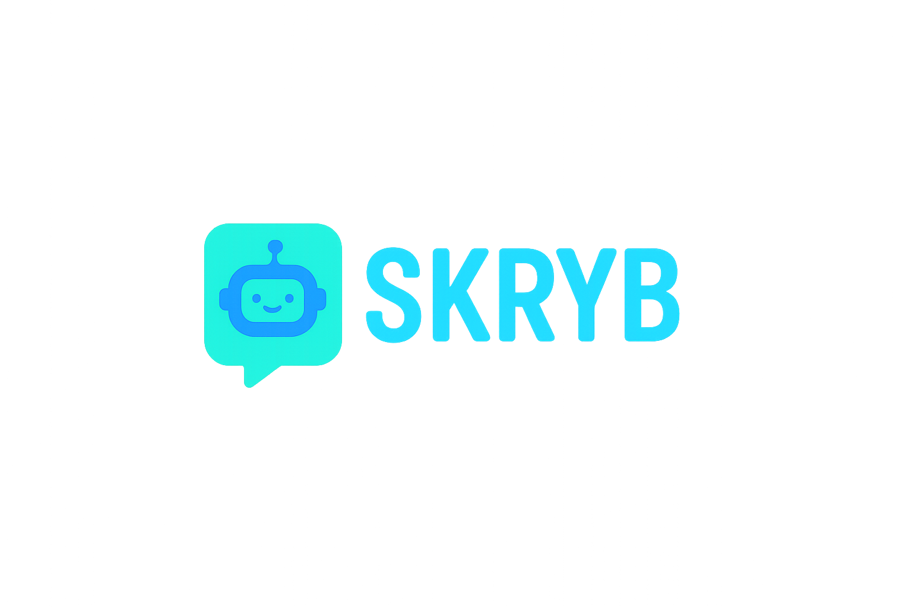

# SKRYB



SKRYB uses OpenAI's APIs (Chat Completions and Images) to generate illustrated books based on user-provided prompts and style choices.

## Features

*   Generates book pages sequentially, maintaining story context via chat history.
*   Creates a cover image based on the chosen style and characters.
*   Supports multiple illustration styles defined in `prompts.json` (e.g., Children's Book, Dark Manga/Anime Comic, 70s Cartoon).
*   Outputs images to a dedicated directory named after the book title.
*   Generated images are created with a wide aspect ratio (1536x1024), high quality, and include instructions to the AI to ensure images are uncropped and any rendered text is fully visible.
*   **Future Improvement:** Currently, image consistency across pages is attempted via detailed text prompts. Future work is needed to leverage the OpenAI Images API's edit endpoint (`/v1/images/edits`) to potentially improve character and scene consistency by using the previous page's image as a reference for generating the next.

## Setup

1.  **Clone the repository:**
    ```bash
    git clone <repository-url>
    cd <repository-directory>
    ```
2.  **Create and activate a virtual environment:**
    ```bash
    python -m venv venv
    # On Windows:
    # venv\Scripts\activate
    # On macOS/Linux:
    # source venv/bin/activate
    ```
3.  **Install dependencies:**
    ```bash
    pip install -r requirements.txt
    ```
4.  **Set up API Key:**
    *   Copy the example environment file:
        ```bash
        cp .env.example .env
        ```
    *   Open the `.env` file and replace `YOUR_API_KEY_HERE` with your actual OpenAI API key.

## Usage

Run the main script:
```bash
python create_book.py
```
You will be prompted to choose a mode:

*   **Full Mode:** You provide the book title, illustration style, number of pages, detailed character descriptions, and a story outline.
*   **Quick Mode:** You provide a basic concept, book title, illustration style, and number of pages. The script will use an LLM to infer suitable characters based on your concept, automatically using them for generation.

Follow the subsequent prompts based on the chosen mode.

```bash
python create_book.py
```

Generated images will be saved in `output_books/<Sanitized_Book_Title>/`.

### Running the Test Script (Uses Full Mode Logic)

The test script generates a predefined book ("A Test Book, featuring Maz & Baz") using the "Dreamy Childrens Book" style.

```bash
python test_book_generation.py
```

Output will be saved in `output_books/A_Test_Book_featuring_Maz_Baz/`.

## Customization: Adding New Styles

You can add your own illustration styles by modifying `prompts.json` and `create_book.py`.

1.  **Edit `prompts.json`:**
    *   Add a new key-value pair for your style, following the pattern of the existing `stage2_image_*` entries. The key should be unique (e.g., `"stage2_image_my_style"`).
    *   Inside the value object, define a `"prompt_template"` string. This template should describe the desired style and must include the following placeholders:
        *   `{scene_description}`: Where the generated scene details will be inserted.
        *   `{character_details_string}`: Where details of characters present in the scene will be inserted.
        *   `{page_text}`: Where the generated text for the page will be inserted (if you want it rendered in the image).
    *   Example:
        ```json
        "stage2_image_pixel_art": {
          "prompt_template": "A pixel art illustration in the style of classic 16-bit games.\\n\\nScene Description: {scene_description}\\n\\nCharacters present:\\n{character_details_string}\\n\\nRender the following text using a blocky pixel font: \"{page_text}\""
        }
        ```

2.  **Edit `create_book.py`:**
    *   Locate the `styles` dictionary near the beginning of the `main()` function.
    *   Add a new entry to this dictionary. The key should be the next available number (as a string), and the value should be an object containing:
        *   `"key"`: The exact key you added to `prompts.json` (e.g., `"stage2_image_my_style"`).
        *   `"desc"`: A short, user-friendly description of your style that will be shown in the menu (e.g., `"16-Bit Pixel Art"`).
    *   Example (adding to existing styles):
        ```python
        styles = {
            "1": {"key": "stage2_image_childrens", "desc": "Dreamy Childrens Book", "type": "childrens"},
            "2": {"key": "stage2_image_dark_anime", "desc": "Dark Manga/Anime Comic", "type": "narrative"},
            "3": {"key": "stage2_image_dreamy_anime", "desc": "Dreamy Anime", "type": "narrative"},
            "4": {"key": "stage2_image_70s_cartoon", "desc": "70s Funky Cartoon", "type": "narrative"},
            "5": {"key": "stage2_image_pixel_art", "desc": "16-Bit Pixel Art", "type": "narrative"} # New entry
        }
```

Now, when you run `python create_book.py`, your new style will appear as an option in the menu.

## Files

*   `.env`: Stores your OpenAI API key (ignored by Git).
*   `.env.example`: Template for the `.env` file.
*   `create_book.py`: Main interactive script for book generation.
*   `openai_api.py`: Handles communication with OpenAI APIs.
*   `prompts.json`: Contains prompt templates for text and image generation styles.
*   `requirements.txt`: Lists Python dependencies.
*   `test_book_generation.py`: Script for running a predefined test case.
*   `generate_single_image.py`: Standalone script to generate a single image (example).
*   `output_books/`: Directory where generated books are saved (ignored by Git).
